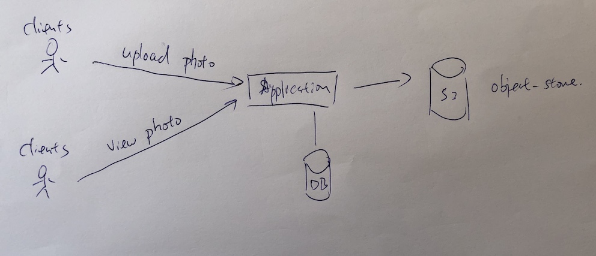
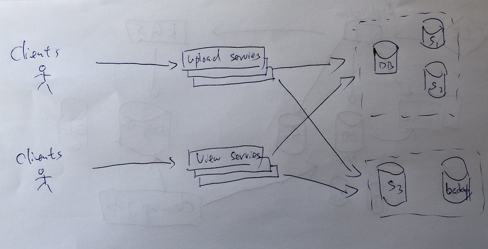
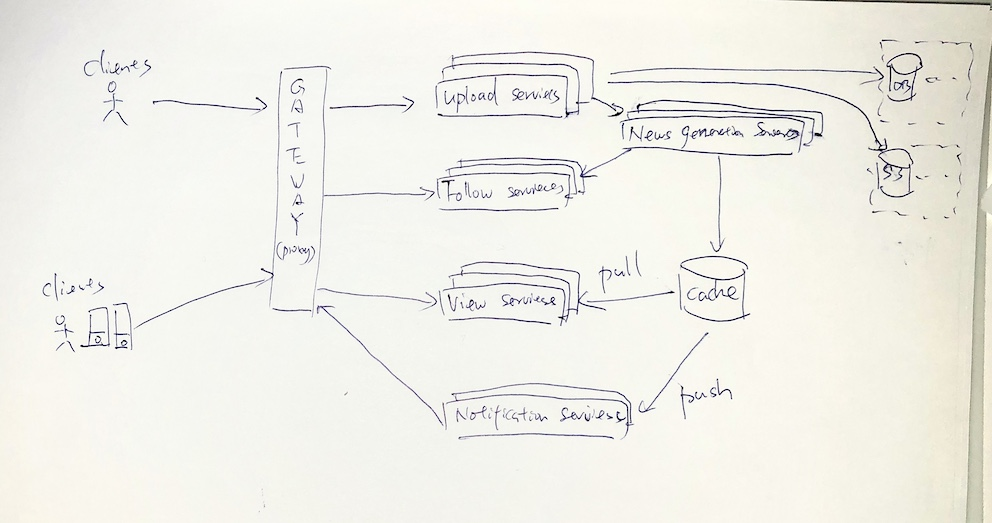

# Instagram

## 明确需求

- 功能性需求
    - 用户可以上传，下载，浏览照片
    - 用户可以分享照片
    - 用户可以追踪其他人
    - 可以生成和展示用户News Feed，包括所有追踪的人上传照片

- 非功能性需求
    - 系统要有高可用性，一个service down 了 其他service可以继续提供服务
    - 系统要有高可靠性，用户上传的照片，视频不可以丢失
    - 一致性可能会收到影响，但用户上传照片后没有马上看到，应该可以接受
    - 生成New Feed，在200ms内的延迟是可以接受的

## 设计中的一些注意事项

1. 用户可以上传任意张照片，所以有效的存储管理是关键
2. 在展示用户照片时要低延迟
3. 用户数据一定不能丢失

## 估算和约束

- 流量估算
    - 假设有500M个用户，Daily active user 有1M
    - 每个用户每天上传2张战片，所以每天一共1M*2 = 2M张照片
    - QPS = 2M/(24*3600) = ~23张照片/s
- 存储估算
    - 平均每张照片>=200KB
    - 每天200KB * 200M = 400GB
    - 一年400GB*365*10 = 1460TB
- 带宽估算
    - 平均每张照片>=200KB
    - 23 * 200KB = 4.6MB/s

## High Level System Design

## DB Design

User: userID | Name | Email | DOB | CreationDate | LastLogin
Photo: PhotoID | Title | Path | CreationDate
Follw: userID | FolloweeID

由于系统是Read-Heavy，所以我们可以利用NoSQL DB可扩展性强的优势，建立KEY-VAL pairs
例如
Photo: key = photoID, val = {title, path, date}
UserPhoto： key = userID， val = {[PhotoID, ..., ... ]}
UserFollow= key = userID, val = {[userID, ..., ...]}

## 数据大小估算(for 10 year)

User = ~68bytes(每条数据)， 如果有5Muser， 那么大小为500M * 68bytes = ~35GB

Photo = ~200bytes(每条数据), 每天2M张图片，2M*200bytes = 400MB, 10年就是 400MB*365*10 = ~1.6TB

UserFollow = 8bytes((每条数据)), 500M用户，没人follow 500 人， 500M*500*8 = ~1.82TB

所以一共是 35GB + 1.6TB + 1.82TB = ~3.46TB

## 组件设计

由于写入操作非常慢，但是读操作需要很快，为了避免连接资源被写操作占满，最好分成两个server分别接受写于读的请求

## 可靠性和冗余

- 对application server， 需要multiple replicas of service running in the system
- 对于DB， 创建replica or backup DB

## Data Sharding

假设每个Shard 有1TB， 我们需要3.46TB。所以最起码需要4个shard。但为了更好的性能，我们可以扩展到10个shard

- Partitioning based in PhotoID
    - 生成唯一个PhotoID， 再PhotoID%10
    - 如何生成PhotoID，可以用Key Generation service 处理

## Cache

- CDN for photo cache service
- MemCache Redis for DB cache service and News Feed

## 生成News Feed

- 首先我们有一个follow sevices/API， 计算某一个user的所有follower
- 有个Upload/Post service， 接受用户上传/发布新照片的请求
- 有个News Feed service，预计算所有user的News Feed。因为每次用户刷新，系统都要重新计算News Feed，相当的不高效
- 生成News feed 的流程：
    1. 有用户发布了一个新Photo。
    2. Upload service 会通知News Feed service。
    3. News Feed service 会从follow sevices 获取谁在追踪这个用户
    4. 然后将这个新Photo append 在每一个追踪这个用户的用户的news feed中
    5. News feed 存储在Cache中(LRU)， 因为任何时间Newas feed丢失都可以重新计算。用LRU策略是可以节省Cache的空间，不经常登陆的用户就没必要存储News feed。等用户什么时候登陆再重新计算News Feed 就好
- News Feed notification
    - 少于10K个Follower，一旦有更新，Push notification给Follower
    - 多于10K个Follower 比如网红，名人，一旦有更新，不Push，因同时10K+个Notification太耗资源。等Follower上线，刷新News feed时再Pull Data给Follower

